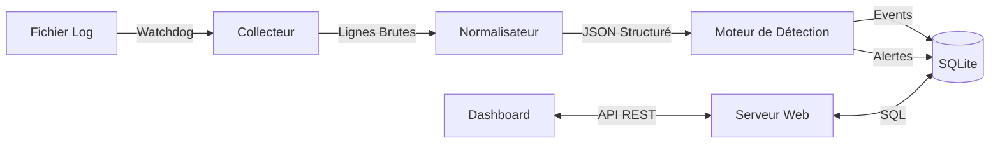

# 1. Vue d'Ensemble Technique

## Architecture Globale

LogMonitor repose sur une architecture de **pipeline de données** exécutée en arrière-plan (Daemon), couplée à une interface de visualisation (Web).

Le système est conçu pour être :
*   **Modulaire** : Chaque étape (lecture, analyse, détection, stockage) est indépendante.
*   **Léger** : Utilisation de SQLite et de bibliothèques standards ou légères (Watchdog, Flask).
*   **Temps Réel** : Les logs sont traités dès leur écriture sur le disque.



## Arborescence du Projet

Voici la structure détaillée des fichiers sources (`logmonitor/`) :

```text
logmonitor/
├── cli/                    # Interface Ligne de Commande
│   ├── __init__.py
│   └── commands.py         # Définition des commandes (scan, start, web...)
│
├── core/                   # Cœur du système de surveillance
│   ├── collector.py        # Lecture des fichiers (Batch & Streaming)
│   ├── normalizer.py       # Parsing des logs (Regex -> JSON)
│   ├── detector.py         # Moteur de coordination des règles
│   └── rules.py            # Définition des règles de sécurité (Classes)
│
├── storage/                # Persistance des données
│   ├── database.py         # Abstraction SQLite (ORM maison)
│
├── web/                    # Application Web (Dashboard)
│   ├── app.py              # Serveur Flask & Routes API
│   ├── templates/          # Vues HTML (Jinja2)
│   └── static/             # Assets JS (Chart.js) & CSS
│
└── reporting/              # Génération de rapports
    └── generator.py        # Création des fichiers PDF/CSV
```

## Technologies Clés

| Composant | Technologie | Rôle |
|-----------|-------------|------|
| **Langage** | Python 3.10+ | Logique principale |
| **Parsing** | Regex (re) | Extraction des données non structurées |
| **Monitoring** | Watchdog | Détection efficace des modifications de fichiers |
| **Base de données** | SQLite 3 | Stockage local performant et sans serveur |
| **Web Backend** | Flask | Serveur HTTP pour l'API et le HTML |
| **Web Frontend** | Chart.js | Visualisation des graphiques |
| **CLI** | Click | Gestion des commandes terminal riches |

[Suivant : Moteur de Détection >](./02_Core_Engine.md)
