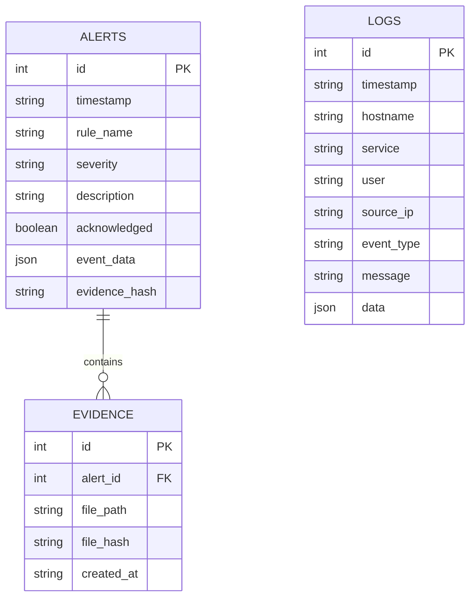

# 3. Base de Données (`database.py`)

LogMonitor utilise **SQLite** pour sa simplicité. Le fichier de base de données est localisé par défaut dans `data/logmonitor.db`.

Le module `storage.database` agit comme une couche d'abstraction (Pattern DAO) pour éviter d'écrire du SQL brut ailleurs dans le code.

## Schéma Relationnel

## Détails des Tables

### Table `logs`
Stocke tous les événements *parsés* (pas seulement les alertes).
*   Utilisée pour les statistiques générales (ex: "Top IPs suspectes").
*   La colonne `data` stocke le JSON complet de l'événement pour la flexibilité future.

### Table `alerts`
Stocke les incidents de sécurité détectés par le moteur.
*   `severity` : Niveau de gravité (low, medium, high, critical).
*   `acknowledged` : Booléen (0/1) indiquant si l'admin a vu l'alerte via le Dashboard.
*   `event_data` : Copie de l'événement qui a déclenché l'alerte (instantané figé).

### Table `evidence`
Assure l'intégrité des alertes critiques (Forensic).
*   Lorsqu'une alerte est créée, les données brutes sont sauvegardées dans un fichier JSON séparé (`data/evidence/`).
*   Le hash SHA-256 de ce fichier est stocké dans la DB pour prouver que la preuve n'a pas été altérée.

[< Précédent : Cœur du Système](./02_Core_Engine.md) | [Suivant : Interface Web >](./04_Web_App.md)
